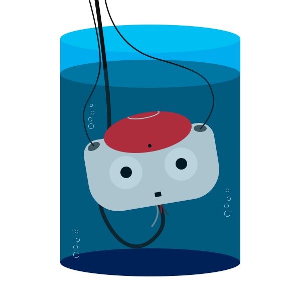

# VATNAO

> **NOTE** this is the legacy code. For further development and integration, check out `utils/vatnao`.



_vision's accesible testing_

Really simple right now.

1. Compile
2. Run:
    ```bash
    vatnao-legacy -f some/offnao/dump/with/raw/images.ofn
    ```
