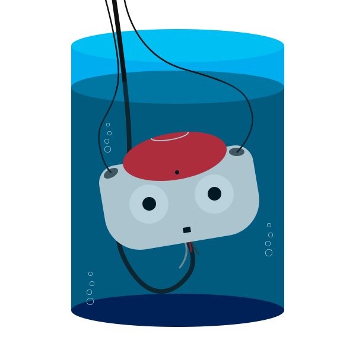

# VATNAO



_Vision's Accesible Testing_

For basic usage:

1. Compile
2. Run:
    ```bash
    vatnao -f some/offnao/dump/with/raw/images.ofn
    ```

To change the colour calibration files used: 

```bash
vatnao -f some/offnao/dump/with/raw/images.ofn
```

## Vision Debug Module (VDM)

Perhaps the most useful tool in vatnao, is the ability to view and "annotate" the regions as they are being processed.
This has been used in the past by sections like ball detector, to see how the ball regions are being broken down. The process is relatively simple.

A word of warning, only one section of code can have access to the vision debug module at a time. It's polite to wrap any of your debugging in `#ifdef` catches and remove the `#define` before merging
your code into master. Use a name unique to your work, for example, if you were working on the `Foo` module:

```c++
// ...

#define FOO_USES_VDM

// ...

#ifdef FOO_USES_VDM
vdm->addOption("Foo's checkbox");
#endif
```

### Importing the vdm

The vision debug module is handled by a single global pointer, `vdm`, defined in `soccer.hpp`. Whenever running vatnao, `vdm` will be initialised, otherwsie will be left as `NULL`.
To import, add the following to the head of any code you are debugging.

```c++
#ifdef FOO_USES_VDM

#include "VisionDebuggerInterface.hpp"
#include "soccer.hpp"

#endif
```

### Setting vdm options

It's possible to set options that you can toggle in the vatnao user interface, to help fine tune what you want to show or adjust parameters. For example, ball detector used options to decide whether or not to overlay the region with what it thought were the black spots. Or, if you're not sure what's the best value for some parameter, just set it to the value of an option and change it at runtime to see how it changes the outcome.

There are three types of options:

* Checkboxes, defined with
    ```c++
vdm->addOption("Single argument for checkboxes");
    ```
* Dropdowns, defined with
    ```c++
vector<string> aList;
aList.push_back("of");
aList.push_back("all");
aList.push_back("the");
aList.push_back("options");
vdm->addOption("The option name and", aList);
    ```
* Numeric, defined with
    ```c++
vdm->addNumericOption("Single argument for numeric");
    ```

The default value for checkboxes is `false`, the default value for dropdowns is whatever you insert first, the default value for numeric is `0`.
Each option must only be set once, and cannot be removed during runtime. It's best to put them in the constructor for a class you're trying to debug. For example:

```c++
#ifdef FOO_USES_VDM

if (vdm != NULL) {
    vdm->addOption("Show Outline");
}

#endif
```

### Using vdm options

To use vdm options in the codebase, use the `vdm->getQuery()` method. This returns a `VisionDebugQuery` which has a map of the option values and another map of numeric values.

```c++
#ifdef FOO_USES_VDM

if (vdm != NULL) {
    VisionDebugQuery q = vdm->getQuery();
    if (q.options["Show Outline"] == "true") {
        /* ... */
    }
    threshold_value_ = q.numeric_options["Threshold"];
}

#endif
```

> Important Note: The value returned by checkboxes is actually a string. Either `"true"` or `"false"`. It cannot be treated as a normal boolean unless you convert it.

> Another Note: The value of a numeric option is a double. If you intend to use it as an integer it must be cast.

### Using vdm message

There is a space in vatnao for displaying some message, this can be set in one of two ways. First:

```c++
#ifdef FOO_USES_VDM

if (vdm != NULL) {
    vdm->setDebugMessage("Directly through message");
    // OR
    vdm->msg << "Using streaming " << "like std::cout" << std::endl;
    vdm->msg << "Which can continue in multiple places" << std::endl;
    vdm->msg << "And easily be used with " << variables << std::endl;
    vdm->msg << "To confirm, just call setDebugMessage without arguments";

    vdm->setDebugMessage();
}

#endif
```

Calling `setDebugMessage` overrides whatever was previously written and clears the `vdm->msg` buffer.

### Using the VisionPainter

It is possible to annotate directly onto a given region, right from your codebase. This was used, for example, in ball detector to show what the ball detector was seeing whenever it looked at a given region.
As the developer, you are given two indexes in the `VisionDebugQuery`: `q.region_index` and `q.subregion_index`, set through the vatnao interface.
Since you define the regions, they don't have any meaning, but are simply helpers to make it easy to navigate from the interface. But a good standard to use is to treat the `q.region_index` as the index of the region in the `regions`/`roi` array, and the `q.subregion_index` as any variation on that region that your code might produce.
The indexes are unbounded unsigned integers, so they will need to be checked.

The `VisionPainter` itself is a simple interface that allows you to draw on regions you pass in through the `vdm->getGivenRegionOberlayPainter()` method.
In the example below, VisionPainter would draw a red circle of radius `5` at coordinate `10`, `10` in the region specified by the `q.region_index`, as long as the `Draw Circle` checkbox has been checked.

```c++
#ifdef FOO_USES_VDM

if (vdm != NULL) {
    VisionDebugQuery q = vdm->getQuery();
    if (q.region_index < info_middle_.roi.size()) {
        VisionPainter *p = vdm->getGivenRegionOverlayPainter(info_middle_.roi[q.region_index]);
        if (q.options["Draw Circle"] == "true") {
            p->drawCircle(10, 10, 5, VisionPainter::RED);
        }
    }
}

#endif
```

The `VisionPainter` has the following methods:
* `draw(x, y, colour)` or `draw(x, y, r, g, b)`

    Fills the pixel at the given x, y coordinates with the given colour.

* `drawLine(x1, y1, x2, y2, colour)` or `drawLine(x1, y1, x2, y2, r, g, b)`

    Draws a line between the two given points of the given colour.

* `drawRect(x, y, w, h, colour)` or `drawRect(x, y, w, h, r, g, b)`

    Draws a rectangle starting at the given x, y coordinates, of the given width and height, in the given colour.

* `drawCircle(x, y, radius, colour)` or `drawCircle(x, y, radius, r, g, b)`

    Draws a circle at the given x, y coordiantes with the given radius, in the given colour.

Defined Colours are `RED`, `GREEN`, `BLUE`, `YELLOW`, `ORANGE`, `PURPLE`, `PINK`, `CYAN`, `LIME`, `WHITE`, `BLACK`, `GREY`.

Whatever region you pass in will be shown twice in vatnao, plain, and with annotations.

Check out `robot/perception/vision/VisionDebuggerInterface.hpp` for all methods you can call.
